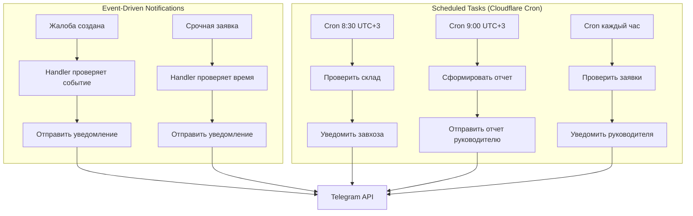

# 🎨 CREATIVE PHASE: Архитектура автоматизации и уведомлений

## PROBLEM STATEMENT

Необходимо спроектировать надежную систему автоматических задач и уведомлений для Telegram бота:

1. **Ежедневные напоминания** (8:30) - проверка минимума на складе
2. **Ежедневный отчет** (9:00) - отчет руководителю за предыдущий день
3. **Мгновенные уведомления** - при поступлении жалобы, срочной заявке
4. **Проверка заявок** - срочные >2 часов в статусе "Новая", в работе >7 дней

**Вызовы:**
- Cloudflare Workers имеет ограничения по времени выполнения
- Нужна надежность - задачи должны выполняться даже при сбоях
- Часовой пояс (UTC+3) для расписания
- Масштабируемость для будущего расширения

---

## OPTIONS ANALYSIS

### Option 1: Cloudflare Cron Triggers
**Подход:** Встроенные cron триггеры Cloudflare Workers

**Структура:**
```
Cloudflare Cron → Worker Function → Check Tasks → Send Notifications
```

**Плюсы:**
- ✅ Нативная интеграция с Cloudflare
- ✅ Бесплатно на бесплатном тарифе
- ✅ Надежность (Cloudflare инфраструктура)
- ✅ Простая настройка

**Минусы:**
- ❌ Ограничение по времени выполнения (10-30 сек)
- ❌ Минимальный интервал: 1 минута
- ❌ Может быть недостаточно для сложных задач

**Оценка:** ⭐⭐⭐ (3/5) - подходит для простых задач

---

### Option 2: External Scheduler Service
**Подход:** Использование внешнего сервиса (Cron-job.org, EasyCron, etc.)

**Структура:**
```
External Cron → HTTP Request → Worker Endpoint → Process Task
```

**Плюсы:**
- ✅ Гибкость в настройке расписания
- ✅ Нет ограничений по времени
- ✅ Можно использовать любой часовой пояс

**Минусы:**
- ❌ Зависимость от внешнего сервиса
- ❌ Может быть бесплатно, но с ограничениями
- ❌ Дополнительная точка отказа

**Оценка:** ⭐⭐⭐ (3/5) - зависимость от стороннего сервиса

---

### Option 3: Database-based Scheduler (Polling)
**Подход:** Периодическая проверка задач в БД через основной worker

**Структура:**
```
User Request → Worker → Check Scheduled Tasks → Process if Needed
```

**Плюсы:**
- ✅ Не требует внешних сервисов
- ✅ Полный контроль
- ✅ Можно кэшировать задачи

**Минусы:**
- ❌ Не гарантирует точное время выполнения
- ❌ Зависит от активности пользователей
- ❌ Может пропустить задачи в неактивные периоды

**Оценка:** ⭐⭐ (2/5) - ненадежно для критичных задач

---

### Option 4: Hybrid Approach (Рекомендуется)
**Подход:** Комбинация Cloudflare Cron + обработчики в основном боте

**Структура:**
```
Critical Tasks (Daily Reports) → Cloudflare Cron
Instant Notifications → Main Bot Handlers
Periodic Checks → Cloudflare Cron (every hour)
```

**Плюсы:**
- ✅ Надежность для критичных задач
- ✅ Мгновенность для событийных уведомлений
- ✅ Гибкость для разных типов задач
- ✅ Оптимальное использование ресурсов

**Минусы:**
- ❌ Немного сложнее архитектура
- ❌ Нужно разделить логику

**Оценка:** ⭐⭐⭐⭐⭐ (5/5) - оптимальный баланс

---

## DECISION

**Выбранный подход:** **Option 4 - Hybrid Approach**

### Обоснование:

1. **Надежность:** Cloudflare Cron гарантирует выполнение ежедневных задач
2. **Мгновенность:** Обработчики в боте сразу реагируют на события
3. **Гибкость:** Можно добавить разные типы задач
4. **Эффективность:** Используем сильные стороны каждого подхода

---

## IMPLEMENTATION DESIGN

### Architecture Overview



### Task Types Classification

#### 1. Instant Notifications (Мгновенные)
**Триггер:** Событие в боте
**Обработка:** В основном обработчике

- Жалоба создана → мгновенно руководителю и завхозу
- Срочная заявка создана → логировать время создания
- Заявка изменена → уведомить сотрудника (если нужно)

**Реализация:**
```python
# В обработчике создания жалобы
async def create_complaint_handler(...):
    complaint = await save_complaint(...)
    
    # Мгновенное уведомление
    await notification_service.send_complaint_notification(
        complaint=complaint,
        manager_id=config.MANAGER_ID,
        warehouseman_id=config.WAREHOUSEMAN_ID
    )
```

#### 2. Scheduled Tasks (По расписанию)
**Триггер:** Cloudflare Cron
**Обработка:** Отдельный worker endpoint

**8:30 - Проверка склада:**
```python
# scheduled/warehouse_check.py
async def warehouse_check_task():
    items_below_min = await warehouse_service.get_items_below_minimum()
    
    if items_below_min:
        message = format_low_stock_message(items_below_min)
        await bot.send_message(
            chat_id=config.WAREHOUSEMAN_ID,
            text=message
        )
```

**9:00 - Ежедневный отчет:**
```python
# scheduled/daily_report.py
async def daily_report_task():
    yesterday = get_yesterday_date()
    report = await report_service.generate_daily_report(yesterday)
    
    message = format_daily_report(report)
    await bot.send_message(
        chat_id=config.MANAGER_ID,
        text=message
    )
```

**Каждый час - Проверка заявок:**
```python
# scheduled/check_stale_requests.py
async def check_stale_requests():
    # Проверить срочные заявки >2 часов
    urgent_old = await request_service.get_urgent_overdue(hours=2)
    
    # Проверить заявки в работе >7 дней
    old_in_progress = await request_service.get_old_in_progress(days=7)
    
    if urgent_old or old_in_progress:
        await send_stale_notification(urgent_old, old_in_progress)
```

### Notification Service Design

```python
from dataclasses import dataclass
from typing import List, Optional
from datetime import datetime

@dataclass
class Notification:
    """Уведомление для отправки"""
    chat_id: int
    message: str
    parse_mode: Optional[str] = "HTML"
    reply_markup: Optional[Any] = None
    priority: str = "normal"  # 'instant', 'normal', 'low'
    
class NotificationService:
    """Сервис для управления уведомлениями"""
    
    async def send_instant(self, notification: Notification):
        """Мгновенная отправка"""
        try:
            await bot.send_message(
                chat_id=notification.chat_id,
                text=notification.message,
                parse_mode=notification.parse_mode,
                reply_markup=notification.reply_markup
            )
        except Exception as e:
            logger.error(f"Failed to send notification: {e}")
    
    async def send_complaint_notification(
        self,
        complaint: Complaint,
        manager_id: int,
        warehouseman_id: int
    ):
        """Отправка уведомления о жалобе"""
        message = format_complaint_message(complaint)
        
        # Руководителю
        await self.send_instant(Notification(
            chat_id=manager_id,
            message=f"🚨 <b>Новая жалоба на завхоза</b>\n\n{message}",
            priority="instant"
        ))
        
        # Завхозу (копия)
        await self.send_instant(Notification(
            chat_id=warehouseman_id,
            message=f"⚠️ <b>Копия жалобы</b>\n\n{message}",
            priority="normal"
        ))
```

### Cloudflare Cron Configuration

```toml
# wrangler.toml
[triggers]
crons = [
  "30 5 * * *",  # 8:30 UTC+3 (5:30 UTC) - проверка склада
  "0 6 * * *",   # 9:00 UTC+3 (6:00 UTC) - ежедневный отчет
  "0 * * * *"    # Каждый час - проверка заявок
]
```

### Worker Endpoints Structure

```python
# main.py (Cloudflare Worker)
from aiogram import Bot, Dispatcher
from scheduled import warehouse_check, daily_report, check_stale_requests

@app.route("/cron/warehouse", methods=["POST"])
async def warehouse_cron(request):
    """Обработчик cron для проверки склада"""
    await warehouse_check_task()
    return json_response({"status": "ok"})

@app.route("/cron/daily-report", methods=["POST"])
async def daily_report_cron(request):
    """Обработчик cron для ежедневного отчета"""
    await daily_report_task()
    return json_response({"status": "ok"})

@app.route("/cron/check-stale", methods=["POST"])
async def check_stale_cron(request):
    """Обработчик cron для проверки заявок"""
    await check_stale_requests_task()
    return json_response({"status": "ok"})
```

### Timezone Handling

```python
import pytz
from datetime import datetime

TIMEZONE = pytz.timezone("Europe/Moscow")  # UTC+3

def get_current_time_in_timezone():
    """Получить текущее время в часовом поясе проекта"""
    return datetime.now(TIMEZONE)

def format_time_for_display(dt: datetime) -> str:
    """Форматировать время для отображения"""
    return dt.strftime("%d.%m.%Y %H:%M")
```

### Error Handling & Retry Logic

```python
from tenacity import retry, stop_after_attempt, wait_exponential

@retry(
    stop=stop_after_attempt(3),
    wait=wait_exponential(multiplier=1, min=4, max=10)
)
async def send_notification_with_retry(notification: Notification):
    """Отправка с повторными попытками"""
    try:
        await notification_service.send_instant(notification)
    except Exception as e:
        logger.error(f"Notification failed: {e}")
        raise  # Retry will be handled by decorator
```

---

## VISUAL FLOW DIAGRAMS

### Daily Warehouse Check Flow

```
8:30 UTC+3 (Cron Trigger)
    ↓
┌──────────────────────────┐
│ Проверить все позиции    │
│ на складе                │
└───────────┬──────────────┘
            ↓
┌──────────────────────────┐
│ Найти позиции с          │
│ остатком ≤ минимума      │
└───────────┬──────────────┘
            ↓
    ┌───────┴───────┐
    │ Есть такие?   │
    └───┬───────┬───┘
      Да│       │Нет
        │       │
        ↓       ↓
┌──────────────┐  ┌──────────────┐
│ Сформировать │  │ Завершить    │
│ сообщение    │  │ (нет данных) │
│ со списком   │  │              │
└──────┬───────┘  └──────────────┘
       │
       ↓
┌──────────────────────────┐
│ Отправить завхозу        │
│ "⚠️ На складе низкий     │
│ остаток: ..."            │
└──────────────────────────┘
```

### Event-Driven Notification Flow

```
Событие в боте
    ↓
┌──────────────────────────┐
│ Handler обрабатывает     │
│ событие                  │
└───────────┬──────────────┘
            ↓
┌──────────────────────────┐
│ Проверить тип события    │
└───┬──────┬───────┬───────┘
    │      │       │
Жалоба│      │Заявка│Заявка
создана│      │изменена│срочная
    │      │       │
    ↓      ↓       ↓
┌──────┐ ┌──────┐ ┌──────┐
│Немед-│ │Уведо-│ │Записать│
│ленная│ │мить  │ │время   │
│отправка││польз-│ │создания│
└──────┘ │зователя│ └──────┘
         └──────┘
```

---

## IMPLEMENTATION CHECKLIST

- [ ] Создать NotificationService
- [ ] Настроить Cloudflare Cron триггеры
- [ ] Реализовать warehouse_check_task
- [ ] Реализовать daily_report_task
- [ ] Реализовать check_stale_requests_task
- [ ] Реализовать обработку часового пояса
- [ ] Добавить retry логику для уведомлений
- [ ] Добавить логирование всех задач
- [ ] Настроить error handling
- [ ] Протестировать все автоматические задачи

---

## NEXT STEPS

После проектирования архитектуры автоматизации:

1. Спроектировать UI/UX потоки для всех ролей
2. Проработать систему нумерации заявок
3. Перейти к реализации

---

**Статус:** ✅ Дизайн завершен
**Следующий шаг:** Продолжить CREATIVE фазу для других компонентов

