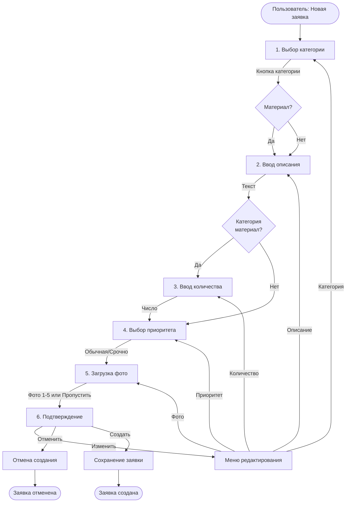

# 🎨 CREATIVE PHASE: FSM Master для создания заявки

## PROBLEM STATEMENT

Необходимо спроектировать удобный и интуитивный пошаговый мастер создания заявки в Telegram боте. Мастер должен:

1. Провести пользователя через 6 шагов (некоторые условные)
2. Собрать все необходимые данные
3. Позволить отменить процесс на любом этапе
4. Обработать ошибки валидации
5. Показать предварительный просмотр перед сохранением
6. Сохранить фото (до 5 штук)

**Вызовы:**
- Условный шаг 3 (количество) - только для некоторых категорий
- Возможность загрузки нескольких фото
- Валидация на каждом шаге
- Возможность отменить/вернуться назад

---

## OPTIONS ANALYSIS

### Option 1: Linear FSM (Последовательный FSM)
**Подход:** Строго последовательные состояния без возврата назад

**Структура:**
```
START → CATEGORY → DESCRIPTION → QUANTITY? → PRIORITY → PHOTOS → CONFIRM → SAVE
```

**Плюсы:**
- ✅ Простая реализация
- ✅ Легко понять логику
- ✅ Меньше состояний

**Минусы:**
- ❌ Нет возможности вернуться и исправить
- ❌ Плохой UX (если ошибка - нужно начать заново)
- ❌ Негибкая система

**Оценка:** ⭐⭐ (2/5) - слишком простое решение

---

### Option 2: FSM with Back Navigation (FSM с возможностью вернуться)
**Подход:** Последовательные состояния с возможностью возврата к предыдущим шагам

**Структура:**
```
START → CATEGORY ↔ DESCRIPTION ↔ QUANTITY? ↔ PRIORITY ↔ PHOTOS ↔ CONFIRM → SAVE
         ↑_________________________________________________|
```

**Плюсы:**
- ✅ Хороший UX (можно исправить ошибки)
- ✅ Гибкость для пользователя
- ✅ Стандартный подход для мастеров

**Минусы:**
- ❌ Больше состояний и логики
- ❌ Нужно сохранять промежуточные данные

**Оценка:** ⭐⭐⭐⭐ (4/5) - хороший баланс

---

### Option 3: Wizard with Data Context (Мастер с контекстом данных)
**Подход:** FSM с отдельным объектом данных, который сохраняется на каждом шаге

**Структура:**
```
States: 
- WaitingForCategory
- WaitingForDescription
- WaitingForQuantity (optional)
- WaitingForPriority
- WaitingForPhotos
- WaitingForConfirmation

Data Context Object:
{
  category: str | None
  description: str | None
  quantity: int | None
  priority: str | None
  photos: List[str]
}
```

**Плюсы:**
- ✅ Гибкость (можно менять данные)
- ✅ Возможность отмены без потери данных
- ✅ Легко добавить автосохранение
- ✅ Четкое разделение состояний и данных

**Минусы:**
- ❌ Немного сложнее реализация
- ❌ Нужно управлять контекстом

**Оценка:** ⭐⭐⭐⭐⭐ (5/5) - оптимальное решение

---

### Option 4: Conversation-based (Разговорный подход)
**Подход:** Использование aiogram ConversationHandler вместо FSM

**Плюсы:**
- ✅ Встроенная поддержка в aiogram
- ✅ Автоматическое управление состояниями

**Минусы:**
- ❌ Меньше контроля над процессом
- ❌ Сложнее обрабатывать условные шаги
- ❌ Устаревший подход (ConversationHandler deprecated в aiogram 3.x)

**Оценка:** ⭐⭐ (2/5) - не подходит для aiogram 3.x

---

## DECISION

**Выбранный подход:** **Option 3 - Wizard with Data Context**

### Обоснование:

1. **Гибкость и UX:** Пользователь может исправить любой шаг, не начиная заново
2. **Современный подход:** Использует FSMContext из aiogram 3.x
3. **Масштабируемость:** Легко добавить новые шаги или изменить порядок
4. **Надежность:** Данные хранятся в контексте, не теряются при ошибках
5. **Условная логика:** Легко реализовать пропуск шага с количеством

---

## IMPLEMENTATION DESIGN

### State Machine Flow



### FSM States Definition

```python
from aiogram.fsm.state import State, StatesGroup

class RequestCreationStates(StatesGroup):
    """Состояния для создания заявки"""
    waiting_for_category = State()      # Шаг 1: Выбор категории
    waiting_for_description = State()   # Шаг 2: Ввод описания
    waiting_for_quantity = State()      # Шаг 3: Ввод количества (условно)
    waiting_for_priority = State()      # Шаг 4: Выбор приоритета
    waiting_for_photos = State()        # Шаг 5: Загрузка фото
    waiting_for_confirmation = State()  # Шаг 6: Подтверждение
```

### Data Context Structure

```python
from dataclasses import dataclass, field
from typing import List, Optional

@dataclass
class RequestCreationData:
    """Данные создаваемой заявки"""
    category: Optional[str] = None
    description: Optional[str] = None
    quantity: Optional[int] = None
    priority: Optional[str] = None  # 'normal' or 'urgent'
    photos: List[str] = field(default_factory=list)  # Telegram file_id
    
    def is_material_category(self) -> bool:
        """Проверка, является ли категория материалом"""
        material_categories = [
            "Канцелярия",
            "Чай, кофе, сахар, вода",
            "Хозтовары и уборка",
            "ИТ-оборудование и расходники"
        ]
        return self.category in material_categories
    
    def is_complete(self) -> bool:
        """Проверка полноты данных"""
        required = [
            self.category,
            self.description,
            self.priority
        ]
        
        # Если категория - материал, то количество обязательно
        if self.is_material_category() and not self.quantity:
            return False
            
        return all(required)
    
    def to_preview_text(self) -> str:
        """Форматирование для предпросмотра"""
        text = f"📋 <b>Предпросмотр заявки</b>\n\n"
        text += f"📂 <b>Категория:</b> {self.category}\n"
        text += f"📝 <b>Описание:</b> {self.description}\n"
        
        if self.quantity:
            text += f"🔢 <b>Количество:</b> {self.quantity} шт.\n"
            
        priority_emoji = "🚨" if self.priority == "urgent" else "⏰"
        priority_text = "Срочно" if self.priority == "urgent" else "Обычная"
        text += f"{priority_emoji} <b>Приоритет:</b> {priority_text}\n"
        
        if self.photos:
            text += f"📷 <b>Фото:</b> {len(self.photos)} шт.\n"
            
        return text
```

### Handler Flow Implementation

```python
from aiogram.fsm.context import FSMContext
from aiogram.types import Message, CallbackQuery

# Шаг 1: Выбор категории
@router.message(F.text == "Новая заявка")
async def start_request_creation(message: Message, state: FSMContext):
    """Начало создания заявки"""
    await state.set_state(RequestCreationStates.waiting_for_category)
    await state.update_data(RequestCreationData())
    
    keyboard = create_category_keyboard()
    await message.answer(
        "📂 Выберите категорию заявки:",
        reply_markup=keyboard
    )

# Шаг 2: Ввод описания (после выбора категории)
@router.callback_query(RequestCreationStates.waiting_for_category)
async def process_category(callback: CallbackQuery, state: FSMContext):
    category = callback.data
    await state.update_data(category=category)
    
    await state.set_state(RequestCreationStates.waiting_for_description)
    await callback.message.answer(
        f"✅ Категория: <b>{category}</b>\n\n"
        "📝 Опишите, что нужно или какая проблема:"
    )
    await callback.answer()

# Шаг 3: Ввод количества (условно)
@router.message(RequestCreationStates.waiting_for_description)
async def process_description(message: Message, state: FSMContext):
    description = message.text
    data = await state.get_data()
    data['description'] = description
    
    # Проверка, нужен ли шаг с количеством
    if data.get('is_material_category'):
        await state.set_state(RequestCreationStates.waiting_for_quantity)
        await message.answer("🔢 Укажите количество:")
    else:
        # Пропускаем шаг с количеством
        await state.set_state(RequestCreationStates.waiting_for_priority)
        await show_priority_keyboard(message)

# ... (продолжение для остальных шагов)
```

### Key Design Decisions

#### 1. **Условный шаг с количеством**
- Используем проверку `is_material_category()` в data context
- Автоматически пропускаем шаг для нематериальных категорий

#### 2. **Загрузка фото**
- Максимум 5 фото
- Пользователь может пропустить этот шаг
- Сохраняем только `file_id` от Telegram (для MVP)
- Подсчет фото: "Фото 1/5, отправьте следующее или нажмите 'Пропустить'"

#### 3. **Редактирование на этапе подтверждения**
- Кнопка "Изменить" открывает меню выбора поля
- Возврат к нужному шагу без потери данных
- Все остальные данные сохраняются в контексте

#### 4. **Валидация**
- Проверка на каждом шаге
- Понятные сообщения об ошибках
- Возможность исправить ошибку без перезапуска

#### 5. **Отмена**
- Кнопка "Отменить" на любом этапе
- Очистка состояния FSM
- Возврат в главное меню

---

## VISUAL FLOW DIAGRAM

### Complete User Journey

```
┌─────────────────────────────────────────┐
│  Пользователь нажимает "Новая заявка"   │
└──────────────┬──────────────────────────┘
               │
               ▼
┌─────────────────────────────────────────┐
│  Шаг 1: Показываем 9 категорий кнопками │
│  ┌─────┐ ┌─────┐ ┌─────┐               │
│  │Канц │ │Чай  │ │Хоз  │ ...            │
│  └─────┘ └─────┘ └─────┘               │
└──────────────┬──────────────────────────┘
               │
               ▼
┌─────────────────────────────────────────┐
│  Шаг 2: Запрашиваем текстовое описание  │
│  "Опишите, что нужно..."                │
└──────────────┬──────────────────────────┘
               │
               ▼
        ┌──────┴──────┐
        │ Материал?   │
        └──┬──────┬───┘
          Да│      │Нет
            │      │
    ┌───────┘      └───────┐
    ▼                      ▼
┌─────────┐         ┌─────────────┐
│ Шаг 3:  │         │ Пропускаем  │
│Количество│         │ к Шагу 4   │
└────┬────┘         └──────┬──────┘
     │                     │
     └──────────┬──────────┘
                │
                ▼
┌─────────────────────────────────────────┐
│  Шаг 4: Выбор приоритета                │
│  [Обычная] [🚨 Срочно]                  │
└──────────────┬──────────────────────────┘
               │
               ▼
┌─────────────────────────────────────────┐
│  Шаг 5: Загрузка фото (до 5 шт)         │
│  "Отправьте фото или нажмите Пропустить"│
│  Счетчик: Фото 1/5                      │
└──────────────┬──────────────────────────┘
               │
               ▼
┌─────────────────────────────────────────┐
│  Шаг 6: Подтверждение                   │
│  ┌─────────────────────────────┐        │
│  │ 📋 Предпросмотр заявки      │        │
│  │ Категория: Канцелярия       │        │
│  │ Описание: Нужны ручки       │        │
│  │ Количество: 10 шт.          │        │
│  │ Приоритет: Обычная          │        │
│  │ Фото: 2 шт.                 │        │
│  └─────────────────────────────┘        │
│  [✅ Создать] [✏️ Изменить] [❌ Отменить]│
└──────────────┬──────────────────────────┘
               │
        ┌──────┴──────┐
        │ Действие    │
        └──┬──────┬───┘
    Создать│      │Отменить
           │      │
    ┌──────┘      └──────┐
    ▼                     ▼
┌─────────┐         ┌─────────┐
│ Сохранить│        │ Очистить│
│ в БД    │         │ FSM     │
└────┬────┘         └────┬────┘
     │                   │
     ▼                   ▼
┌─────────┐         ┌─────────┐
│ Заявка  │         │ Возврат │
│ создана │         │ в меню  │
└─────────┘         └─────────┘
```

---

## ERROR HANDLING

### Validation Errors

1. **Пустое описание:**
   ```
   ❌ Описание не может быть пустым. Пожалуйста, опишите проблему:
   ```

2. **Некорректное количество:**
   ```
   ❌ Пожалуйста, укажите корректное число (например: 10)
   ```

3. **Слишком много фото:**
   ```
   ❌ Можно загрузить максимум 5 фото. Вы уже загрузили 5 фото.
   [Перейти к подтверждению]
   ```

4. **Некорректный тип файла:**
   ```
   ❌ Пожалуйста, отправьте фото (изображение), а не файл
   ```

### Edge Cases

1. **Пользователь отправляет команду во время создания:**
   - Сохраняем текущее состояние
   - Обрабатываем команду
   - Возвращаемся к текущему шагу

2. **Таймаут FSM (пользователь долго не отвечает):**
   - После 30 минут бездействия очищаем состояние
   - Уведомляем пользователя при следующем сообщении

3. **Ошибка сохранения в БД:**
   - Сохраняем данные в контексте
   - Показываем ошибку
   - Предлагаем повторить

---

## IMPLEMENTATION CHECKLIST

- [ ] Создать RequestCreationStates (FSM состояния)
- [ ] Создать RequestCreationData (dataclass для данных)
- [ ] Реализовать обработчик начала создания заявки
- [ ] Реализовать обработчик выбора категории
- [ ] Реализовать обработчик ввода описания
- [ ] Реализовать условную логику для количества
- [ ] Реализовать обработчик выбора приоритета
- [ ] Реализовать обработчик загрузки фото (до 5 шт)
- [ ] Реализовать экран подтверждения с предпросмотром
- [ ] Реализовать меню редактирования
- [ ] Реализовать сохранение заявки в БД
- [ ] Реализовать валидацию на каждом шаге
- [ ] Реализовать обработку ошибок
- [ ] Реализовать отмену создания
- [ ] Добавить таймауты и очистку состояния

---

## NEXT STEPS

После проектирования FSM мастера:

1. Создать аналогичный дизайн для мастера создания жалобы
2. Спроектировать UI/UX для других функций
3. Перейти к реализации после утверждения дизайна

---

**Статус:** ✅ Дизайн завершен
**Следующий шаг:** Реализация в IMPLEMENT режиме

